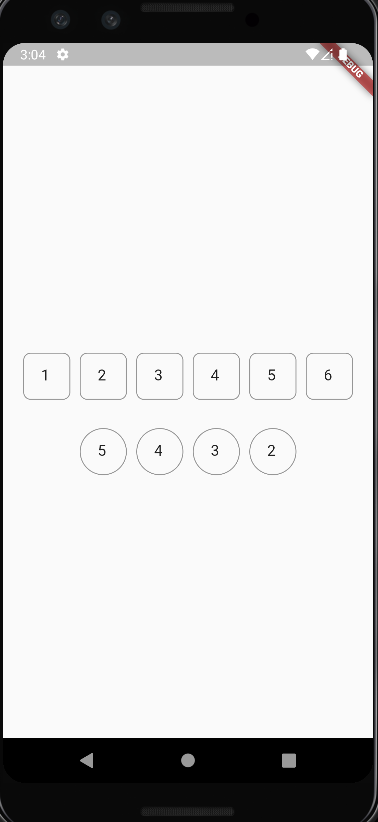

# Flutter Otp Field
Customizable OTP field.

[](https://pub.dev/packages/flutterotpfield)




[Checkout example project](example/lib/main.dart)
## Installation

1. Run this command:
```dart
$ flutter pub add flutterotpfield
```
or manually add this to your pubspec.yaml
```dart
dependencies:
  flutterotpfield: ^0.0.3
```

2. Import package

```dart
import 'package:flutterotpfield/flutterotpfield.dart';
```

3. Use FlutterOtpField widget
```dart
 FlutterOtpField(
inputFieldLength: 6,
spaceBetweenFields: 10,
onValueChange: (String value) {
print("otp changed $value");
},
onCompleted: (String value) {
print("otp  $value");
},)
```

## Documentation
<table>
    <th>Name</th>
    <th>Default Value</th>
    <th>Description</th>
    <th>Required/Optional</th>
    <tr>
        <td>inputFieldLength</td>
        <td>No default value</td>
        <td>Length of the otp boxes</td>
         <td>Required</td>
    </tr>
    <tr>
        <td>inputFieldHeight</td>
        <td>50</td>
        <td>Height of the single otp field</td>
         <td>Optional</td>
    </tr>
     <tr>
        <td>inputFieldWidth</td>
        <td>50</td>
        <td>Width of the single otp field</td>
         <td>Optional</td>
    </tr>
    <tr>
        <td>otpWidgetHeight</td>
        <td>50</td>
        <td>Height of the otp widget</td>
         <td>Optional</td>
    </tr>
    <tr>
        <td>spaceBetweenFields</td>
        <td>5</td>
        <td>Space between two otp fields</td>
         <td>Optional</td>
    </tr>
   <tr>
        <td>autoFocus</td>
        <td>true</td>
        <td>Focus of the first otp field</td>
         <td>Optional</td>
    </tr>
   <tr>
        <td>onValueChange</td>
        <td>-</td>
        <td>Callback function. When single field value is changed, you'll receive value in the onValueChange.</td>
         <td>Required</td>
    </tr>
    <tr>
        <td>onCompleted</td>
        <td>-</td>
        <td>Callback function. When all otp fields are filled, you'll receive otp value in the onCompleted.</td>
         <td>Required</td>
    </tr>
    <tr>
        <td>inputDecoration</td>
        <td>-</td>
        <td>Input decoration for the otp field</td>
         <td>Optional</td>
    </tr>
     <tr>
        <td>cursorColor</td>
        <td>Black</td>
        <td>Color of the cursor</td>
         <td>Optional</td>
    </tr>
    <tr>
        <td>scrollPhysics</td>
        <td>NeverScrollableScrollPhysics</td>
        <td>ScrollPhysics for otp widget</td>
         <td>Optional</td>
    </tr>
</table>
